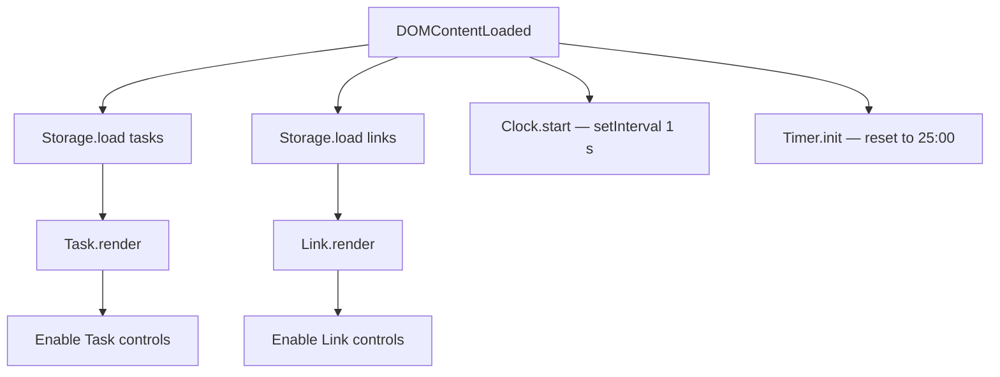

# Design Document — To-Do List Life Dashboard

## Overview

The To-Do List Life Dashboard is a self-contained, single-page web application written in vanilla HTML, CSS, and JavaScript. It requires no build step, no server, and no external dependencies — `index.html` can be opened directly from the file system and works immediately in any modern browser.

The application renders four independent UI components on a single viewport:

| Component | Purpose |
|---|---|
| Clock / Greeting | Shows current time, date, and a time-of-day salutation |
| Focus Timer | Pomodoro-style 25-minute countdown |
| Task List | Persistent, editable to-do list |
| Quick Links | User-defined shortcut buttons that open in new tabs |

All persistent state (tasks and links) lives exclusively in `localStorage`. There is no network layer, no authentication, and no external API calls.

### Design Goals

- **Zero dependencies** — vanilla HTML/CSS/JS only; works on `file://` protocol
- **Instant load** — no parsing/compilation overhead; DOM ready in milliseconds
- **Offline-first** — fully functional without an internet connection
- **Maintainability** — single `js/app.js`, single `css/style.css`, flat file structure

---

## Architecture

### Module Structure (Single File)

All logic lives in `js/app.js`. Because there is no module bundler, the file is organized into clearly commented sections using the IIFE (Immediately Invoked Function Expression) pattern to avoid polluting the global namespace:

```
js/app.js
├── Constants & Configuration
├── Storage Module        — localStorage read/write helpers
├── Clock Module          — time display + greeting logic
├── Timer Module          — Focus Timer state machine
├── Task Module           — task CRUD + persistence
├── Link Module           — quick-link CRUD + persistence
└── Init                  — DOMContentLoaded bootstrap
```

### Initialization Flow



### Timing Strategy

Both the Clock and Focus Timer rely on `setInterval`. A single shared 1-second tick drives the Clock and Greeting update. The Focus Timer uses its own independent `setInterval` that is created on Start and cleared on Stop/Reset, avoiding drift accumulation.

### State Model

The application state at runtime consists of:

```
AppState {
  tasks:   Task[]      // mirrored to localStorage['dashboard_tasks']
  links:   Link[]      // mirrored to localStorage['dashboard_links']
  timer: {
    remaining:  number   // seconds remaining (0–1500)
    state:      'idle' | 'running' | 'paused' | 'done'
    intervalId: number | null
  }
}
```

State is held in plain JavaScript module-scoped variables. There is no reactive framework — every mutation is followed by an explicit re-render call for the affected component.

---

## Components and Interfaces

### 1. Clock Module

**Responsibilities:** Display time (HH:MM:SS), display date, drive Greeting updates.

```
Clock.start()        // begins setInterval(tick, 1000)
Clock.tick()         // reads Date(), updates DOM, triggers Greeting.update()
Clock.formatTime(d)  // Date → "HH:MM:SS"
Clock.formatDate(d)  // Date → "Monday, 16 June 2025"
```

`Clock.tick()` fires every second. On each tick it:
1. Constructs a new `Date()`
2. Updates `#clock-time` text content
3. Updates `#clock-date` text content
4. Calls `Greeting.update(hour)`

### 2. Greeting Module

**Responsibilities:** Map hour → greeting string; update DOM only when greeting changes.

```
Greeting.update(hour: number)  // 0–23 → sets #greeting text if changed
Greeting.getGreeting(hour)     // pure function: number → string
```

`getGreeting` implements the boundary table:

| Range | Text |
|---|---|
| 05–11 | "Good Morning" |
| 12–17 | "Good Afternoon" |
| 18–20 | "Good Evening" |
| 21–04 | "Good Night" |

### 3. Timer Module

**Responsibilities:** Manage the Focus Timer state machine, update display, handle audio.

```
Timer.init()          // reset to 1500 s, state → idle, update display
Timer.start()         // state → running, create setInterval(tick, 1000)
Timer.stop()          // state → paused, clearInterval
Timer.reset()         // clearInterval, state → idle, call init()
Timer.tick()          // decrement remaining; if 0 → done(), else updateDisplay()
Timer.done()          // state → done, clearInterval, show indicator, playBeep()
Timer.updateDisplay() // remaining → "MM:SS", write to #timer-display
Timer.updateButtons() // enable/disable Start/Stop based on state
Timer.playBeep()      // Web Audio API: creates OscillatorNode, plays short tone
```

**Button State Table:**

| Timer State | Start | Stop |
|---|---|---|
| idle | enabled | disabled |
| running | disabled | enabled |
| paused | enabled | disabled |
| done | disabled | disabled |

### 4. Task Module

**Responsibilities:** CRUD operations on tasks, inline editing, persistence, rendering.

```
Task.load()                  // parse localStorage → tasks[], or []
Task.save()                  // JSON.stringify(tasks) → localStorage synchronously
Task.add(title: string)      // trim, validate, push, save, render
Task.edit(id, newTitle)      // find by id, update title, save, render
Task.toggle(id)              // flip completed flag, save, render
Task.delete(id)              // splice from array, save, render
Task.enterEditMode(id)       // replace title span with input, focus
Task.exitEditMode(id, save)  // validate, update or restore, render
Task.render()                // rebuild #task-list DOM from tasks[] (cap 1000)
Task.renderEmpty()           // show empty-state message
```

**Edit Mode Rules:**
- Only one task may be in edit mode at a time
- Opening a second task's editor commits (or discards if empty) the first
- Enter → commit; Escape → discard; clicking away → commit

### 5. Link Module

**Responsibilities:** CRUD for quick links, URL normalization, persistence, rendering.

```
Link.load()               // parse localStorage → links[], or []
Link.save()               // JSON.stringify(links) → localStorage (≤200ms)
Link.add(label, url)      // validate, normalize URL, push, save, render
Link.delete(id)           // splice, save, render
Link.normalizeUrl(url)    // prepend "https://" if no http(s):// prefix
Link.render()             // rebuild #link-list DOM from links[]
Link.renderEmpty()        // show empty-state message
Link.validateInputs()     // return {labelError, urlError} or null
```

### 6. Storage Module

**Responsibilities:** Centralized localStorage helpers with error handling.

```
Storage.get(key)         // localStorage.getItem → parsed JSON or null
Storage.set(key, value)  // JSON.stringify → localStorage.setItem, catches QuotaExceededError
Storage.KEYS = {
  TASKS: 'dashboard_tasks',
  LINKS: 'dashboard_links'
}
```

`Storage.set` wraps the write in a `try/catch`. On `QuotaExceededError` it calls `UI.showError(message)` and returns `false` without throwing.

---

## Data Models

### Task

```js
{
  id:        string,   // crypto.randomUUID() or Date.now().toString()
  title:     string,   // 1–255 chars (trimmed)
  completed: boolean,  // false on creation
  createdAt: number    // Date.now() — insertion order anchor
}
```

Stored as a JSON array under key `dashboard_tasks`.

### Link

```js
{
  id:    string,  // crypto.randomUUID() or Date.now().toString()
  label: string,  // 1–100 chars (trimmed)
  url:   string   // normalized URL, 1–2048 chars
}
```

Stored as a JSON array under key `dashboard_links`.

### Timer State (in-memory only — not persisted)

```js
{
  remaining:  number,                              // 1500 down to 0
  state:      'idle' | 'running' | 'paused' | 'done',
  intervalId: ReturnType<typeof setInterval> | null
}
```

---

## Correctness Properties

*A property is a characteristic or behavior that should hold true across all valid executions of a system — essentially, a formal statement about what the system should do. Properties serve as the bridge between human-readable specifications and machine-verifiable correctness guarantees.*

### Property 1: Greeting boundary coverage and partition consistency

*For any* local hour value (0–23), `Greeting.getGreeting(hour)` SHALL return exactly one of the four greeting strings ("Good Morning", "Good Afternoon", "Good Evening", "Good Night"), and every hour SHALL map to the correct partition: hours 5–11 → "Good Morning", 12–17 → "Good Afternoon", 18–20 → "Good Evening", and {0–4, 21–23} → "Good Night".

**Validates: Requirements 2.1, 2.2, 2.3, 2.4, 2.6**

---

### Property 2: Non-empty task addition grows the list

*For any* task list of arbitrary length and any non-empty, non-whitespace-only string title, calling `Task.add(title)` SHALL increase the length of the in-memory task array by exactly one.

**Validates: Requirements 4.2, 4.4**

---

### Property 3: Whitespace-only task titles are rejected

*For any* string composed entirely of whitespace characters (spaces, tabs, newlines), calling `Task.add(title)` SHALL not modify the task array and SHALL not write to localStorage.

**Validates: Requirements 4.3**

---

### Property 4: Task persistence round-trip

*For any* array of tasks, serializing with `Storage.set(TASKS_KEY, tasks)` then deserializing with `Storage.get(TASKS_KEY)` SHALL produce an array whose elements are deeply equal to the originals (same id, title, completed, createdAt).

**Validates: Requirements 7.1, 7.2**

---

### Property 5: Task edit preserves or discards based on new title validity

*For any* existing task and any non-empty, non-whitespace-only new title, calling `Task.edit(id, newTitle)` SHALL update the task's title while keeping its id, completed flag, and createdAt unchanged. *For any* whitespace-only new title, `Task.edit` SHALL leave the task's title, id, completed flag, and createdAt all unchanged.

**Validates: Requirements 5.4**

---

### Property 6: Task deletion removes exactly one task

*For any* task list and any valid task id, calling `Task.delete(id)` SHALL reduce the array length by exactly one and SHALL NOT remove any task with a different id.

**Validates: Requirements 6.5**

---

### Property 7: Task completion toggle is idempotent after two calls

*For any* task, calling `Task.toggle(id)` twice in sequence SHALL return the task to its original completion state.

**Validates: Requirements 6.2, 6.3**

---

### Property 8: URL normalization prepends https:// exactly once

*For any* URL string that does not begin with "http://" or "https://" (case-insensitive), `Link.normalizeUrl(url)` SHALL prepend "https://" exactly once. *For any* URL that already begins with "http://" or "https://", the function SHALL return the original URL unchanged.

**Validates: Requirements 8.6**

---

### Property 9: Link persistence round-trip

*For any* array of links, serializing with `Storage.set(LINKS_KEY, links)` then deserializing with `Storage.get(LINKS_KEY)` SHALL produce an array whose elements are deeply equal to the originals (same id, label, url).

**Validates: Requirements 10.1**

---

### Property 10: Focus Timer countdown strictly decrements

*For any* timer in the running state with remaining > 0, each call to `Timer.tick()` SHALL decrease `remaining` by exactly one second, never skipping or double-decrementing.

**Validates: Requirements 3.3**

---

### Property 11: Timer state machine valid transitions

*For any* sequence of valid user actions (start, stop, reset) applied to any timer starting state, the resulting state SHALL always be one of {idle, running, paused, done} and the Start and Stop button enabled states SHALL match the button state table (Start enabled iff state ∈ {idle, paused}; Stop enabled iff state = running).

**Validates: Requirements 3.2, 3.4, 3.5, 3.7, 3.8**

---

## Error Handling

| Scenario | Behavior |
|---|---|
| `localStorage` write fails (QuotaExceededError) | Catch error, display non-blocking warning banner; in-memory state preserved |
| `localStorage` read returns corrupt JSON | Catch `JSON.parse` error, initialize with empty array, display non-blocking warning |
| `localStorage` read returns `null` (key absent) | Treat as empty array; no error shown |
| Task/Link add with empty input | Input-level inline validation message; no array mutation |
| Task edit committed with empty value | Discard change, restore original title; no array mutation |
| Link add with empty label or URL | Inline field-level validation message; no array mutation |
| Web Audio API unavailable | `try/catch` around `AudioContext` creation; silently skip beep |
| `crypto.randomUUID()` unavailable (old browser) | Fall back to `Date.now() + Math.random()` string |

---

## Testing Strategy

### Overview

This feature is a vanilla JS client-side application. The core logic functions — greeting boundary mapping, URL normalization, task/link CRUD, and timer state transitions — are pure or near-pure functions that are excellent candidates for property-based testing. UI rendering and `localStorage` integration are covered by example-based unit tests and manual smoke tests.

### Property-Based Testing

**Library**: [fast-check](https://github.com/dubzzz/fast-check) (JavaScript/TypeScript; zero-runtime-dependency test library)

Each correctness property (1–11 above) SHALL be implemented as a single fast-check property test running a **minimum of 100 iterations**.

Each test SHALL be tagged with a comment in the format:

```js
// Feature: todo-life-dashboard, Property N: <property_text>
```

**Key property test areas:**

| Property | Generator strategy |
|---|---|
| Greeting boundary coverage (P1) | `fc.integer({ min: 0, max: 23 })` |
| Task addition grows list (P2) | `fc.array(taskArb)` + `fc.string({ minLength: 1 }).filter(s => s.trim().length > 0)` |
| Whitespace rejection (P3) | `fc.string().map(s => s.replace(/\S/g, ' '))` |
| Task persistence round-trip (P4) | `fc.array(taskArb)` |
| Edit preserves/discards (P5) | `fc.record({ id, title, completed, createdAt })` |
| Delete removes one (P6) | `fc.array(taskArb, { minLength: 1 })` |
| Toggle idempotence (P7) | `fc.record({ id, completed: fc.boolean() })` |
| URL normalization (P8) | `fc.string()` partitioned by http/https prefix |
| Link persistence round-trip (P9) | `fc.array(linkArb)` |
| Timer tick decrements (P10) | `fc.integer({ min: 1, max: 1500 })` |
| Timer state machine (P11) | `fc.array(fc.constantFrom('start','stop','reset'))` |

### Unit / Example-Based Tests

- Rendering with 0 tasks → empty-state message displayed
- Rendering with 1,001 tasks → only 1,000 visible in DOM
- Clock `formatTime` with midnight edge (00:00:00)
- Clock `formatDate` format shape ("Weekday, DD Month YYYY")
- Timer `playBeep` when `AudioContext` unavailable → no exception thrown
- `Storage.get` with absent key → returns null
- `Storage.set` when quota exceeded → returns false, shows error

### Manual Smoke Tests

- Open `index.html` from `file://` in Chrome, Firefox, Edge, Safari — verify all components render
- Add 5 tasks, reload — verify all 5 persist
- Add a link without `https://` prefix — verify it opens with `https://`
- Run Focus Timer to zero — verify audio plays and completion indicator appears
- Confirm no vertical scrollbar at 1280×720 viewport

### WCAG / Accessibility Notes

Full contrast ratio validation requires manual testing with a color contrast analyzer (e.g., axe DevTools, browser accessibility auditor). The design specifies minimum 14px font and WCAG 2.1 AA contrast ratios (4.5:1 normal, 3:1 large text) as hard requirements in `css/style.css`.
